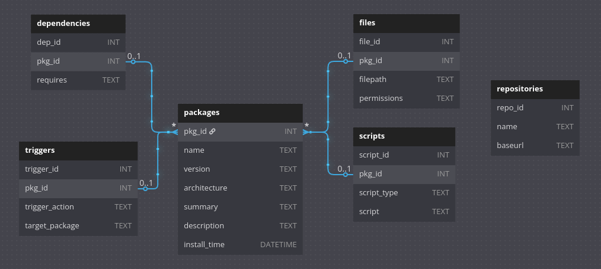

## Package manager DB

A DB that models most relevant entities for a package manager.

About each entity:

-   Packages: information about the packages installed
-   Dependencies: code required by packages
-   Files: track where the packages are installed in your machine
-   Scripts: stores scripts that should be executed before or after installation
-   Triggers: stores actions that run after installation
-   Repositories: repository links for fetching updates / searching for packages

